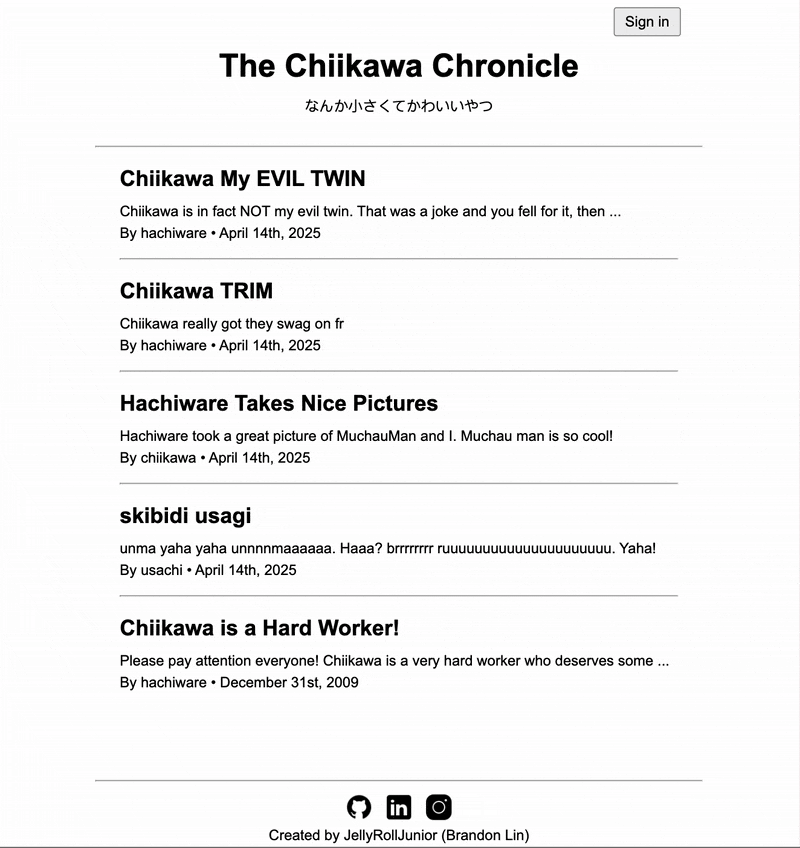
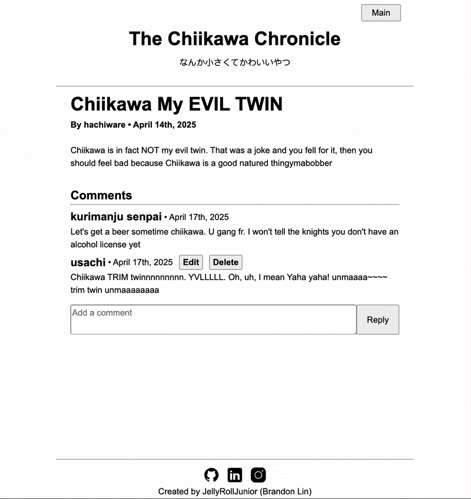

<h1 align="center">The Chiikawa Chronicle</h1>
<h3 align="center">Follow posts by our curated team of authors (me)
<p align="center">
    
</p>

### Start commands

```bash
# Start backend server
cd backend
npm install
node app.js
```

```bash
# Start frontend react
cd frontend-reader
npm install
npm run dev
```

### App Showcase

| Create, Edit, Delete comment                                                       |
| ---------------------------------------------------------------------------------- |
|  |


### Structure

-   Server in "backend" folder
-   Reader site in "frontend-reader" folder
-   ~~Admin site in "frontend-author" folder~~

### Server Stack

-   NodeJS, Express
-   Prisma ORM, PostgreSQL
-   Notable libraries:
    -   Jsonwebtoken & passport jwt: (authorization)
    -   bcryptjs (hashing passwords)
    -   express validator (validating server data)
    -   cors (enable cross origin resource sharing)

### Frontend Stack

-   React, JSX
-   CSS Modules

### Endpoints

| METHOD | URI                                | Function            | Notes       |
| ------ | ---------------------------------- | ------------------- | ----------- |
| POST   | /users                             | Create user         |             |
| POST   | /auth/login                        | Login user          | Returns JWT |
| GET    | /posts                             | Get published posts |             |
| GET    | /posts/admin                       | Get all posts       |             |
| POST   | /posts                             | Create post         |             |
| PUT    | /posts/:postId                     | Update post         |             |
| DELETE | /posts/:postId                     | Delete post         |             |
| GET    | /posts/:postId/comments            | Get post comments   |             |
| POST   | /posts/:postId/comments            | Create post comment |             |
| PUT    | /posts/:postId/comments/:commentId | Update post comment |             |
| DELETE | /posts/:postId/comments/:commentId | Delete post comment |             |

### Learning Outcomes

-   Separating frontend and backend code (Jamstack)!
    -   Thinking from API Client perspective:
        -   What response data do I want when I make a request>
        -   What format would make this data most efficient and usable?
-   More complex prisma queries (nested queries)
-   JsonWebToken authorization!
-   Sending relevant error codes/messages instead of default 500 server error
    -   Keep in mind return obj format + what frontend would like to see when receiving error
-   Relearning React (lol)
    -   Custom hooks for data fetching
    -   Actual error handling for response errors
    -   Writing css framework esque css

### Retrospective aka yapping

-   I quite like separating the frontend and backend. Previously, I found rendering views from the server side a bit cumbersome.
-   Don't throw error from API call util. Let code that called the fetch request handle error
-   Decided not to deploy / make admin portal for this project
    -   This project is a precursor from the ODIN BOOK project anyways

### Acknowledgements

| Usage | Source                                                                               |
| ----- | ------------------------------------------------------------------------------------ |
| Icons | icons8.com                                                                           |
| Specs | [The Odin Project](https://www.theodinproject.com/lessons/node-path-nodejs-blog-api) |
